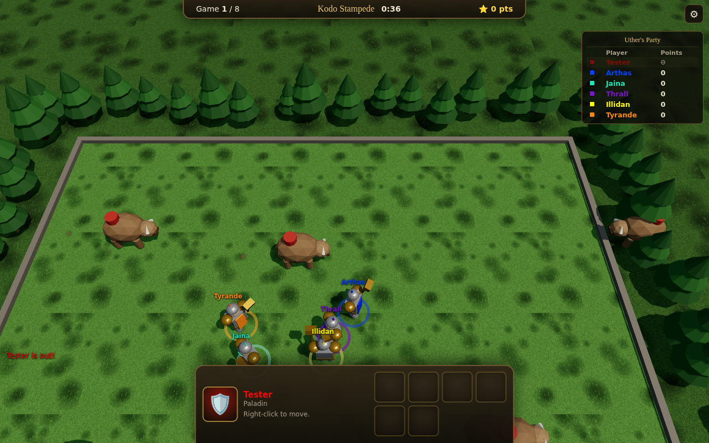

# 🔨 Hammerguy's Party

> **Early access.** The game is playable but still being built. Expect bugs and new minigames.

Hammerguy's Party is a party of chaotic minigames for up to 10 friends, in the browser, inspired by the classic Warcraft III map **Uther Party**:

- **Everyone plays a hammerguy.** Each player is a hammer-wielding paladin.
- **Random minigames.** Games are drawn at random each match.
- **Points for placing.** Place well in each game to earn points; the most points at the end wins.



**Play:** https://tenggames.com.au/hammerguys-party/

## Minigames

| Minigame | Goal | Original |
|---|---|---|
| Kodo Stampede | Beastmasters in the middle send exploding kodos toward both ends. 700 HP; last one standing wins. | Stampede (#17), rules ported |
| Mortar Mayhem | Up to 30 catapults on the banks lob rocks into the pit at 400 u/s, with splash tiers and burning oil. 50 HP. | Peon Pandemonium (#1), rules ported |
| Wisp Wheel | Run with four spokes of fire that speed up and reverse. One Purge (Q, then click) stalls a rival. | Wheel of Fire (#47), rules ported |
| Golem Gauntlet | Race to the finish past patrolling golems. | Like the "Reach the end!" races |
| King of the Hill | Be closest to the centre of the moving circle. **Q** shoves. | New |
| Gold Rush | Collect the most gold. **Q** shoves. | New |
| Ice Sumo | Shove everyone off a shrinking ice floe. | New |
| Sapper Tag | Pass the goblin sapper bomb before it explodes. | Like Hot Mortar (#4) |

Games with no timer in the original have none here either: they run until one player is left.

**Scoring follows the original's "ante".** In survival games the first player out gets 9 − N points (N = players), each later one gets one more, and the last one standing gets 8. Players out at the same instant share a value, and if the timer runs out, every survivor gets the current ante. In races, finishers get 8, 7, 6 … and everyone else 0. A match is 8 games, and tied leaders play tie-breaker games.

Practice one minigame: host with `?only=<id>` in the URL, e.g. `?only=wisp`. The ids are kodo, mortar, wisp, race, koth, gold, sumo and potato.

To add a minigame, create a file in `server/minigames/` that extends `Minigame` (see `server/base.js`), then list it in `server/minigames/index.js`.

## Features

- **Up to 10 players online.** Peer-to-peer multiplayer with no game server: the host's browser runs the party, and friends join with a 4-letter code or an invite link.
- **Bots** in every minigame.
- **Warcraft III feel, measured in the real game.** Uther Party 4.0 was played in Warcraft III 1.26a with an instrumented copy of the map, and the engine follows what the logs show:
  - The heading turns by the turn rate (0.6 rad) every 0.03 s step.
  - The 60° propulsion window is checked before each turn.
  - Units walk at full speed at once and stop dead about 11 units short of the click.
  - A new order stops translation at once.
  - The model's rotation lags behind the heading, so after a 180° turn the unit walks backwards for a moment.
  - Walking units steer round each other and never shove idle ones.
  - Targeted spells turn the caster first and lock it for the cast point.

  `test/wc3.test.js` checks all of this against the measured numbers.
- **Graphics and sound** are generated in code with Three.js and WebAudio. There are no asset files.

## Development

```bash
npm install
npm run dev        # dev server with hot reload → http://localhost:5173
npm test           # every minigame played by bots + multiplayer test
npm run build      # static site → dist/
```

## Deployment

The game is published at **tenggames.com.au/hammerguys-party/** as part of the Teng Games site ([JTstacky/Chess-tutor](https://github.com/JTstacky/Chess-tutor)). As with the site's other games, the built files are committed into that repo at `public/hammerguys-party/`.

On every push to `main`, `.github/workflows/publish.yml` tests and builds, then commits the build to the site as "Hammerguy's Party: update to the latest build". The site's own deploy then publishes it.

That step needs the repository secret `SITE_DEPLOY_TOKEN`: a fine-grained token with access to Chess-tutor only and **Contents: Read and write**. Without the secret, run `scripts/update-games.sh` in Chess-tutor and commit the result.

## How it works

```
client/   game client: entry (main.js), HUD (hud.js), host worker
server/   party.js: rotation and scoring; base.js: minigame base class; minigames/
engine/   shared engine (also used by Arcane Arena):
          sim, rooms, networking, renderer, input, HUD base
docs/     uther-party/: the original maps researched from the source. Rule sheets for all
          90 minigames, measured engine behaviour (engine.md), arena maps, tools
          research.md: early notes from the original Uther Party map
```

**Networking.** The host's browser runs the room in a Web Worker, and guests connect over WebRTC via [PeerJS](https://peerjs.com). `server.js` offers the same rooms over WebSockets for self-hosting.

The engine is copied here and in [Arcane Arena](https://github.com/JTstacky/Arcane-Arena). Port engine fixes across when they matter to both games.

## Credits

Inspired by *Uther Party* by TheZizz. Warcraft is a trademark of Blizzard Entertainment. This fan-made game contains no Blizzard assets.
